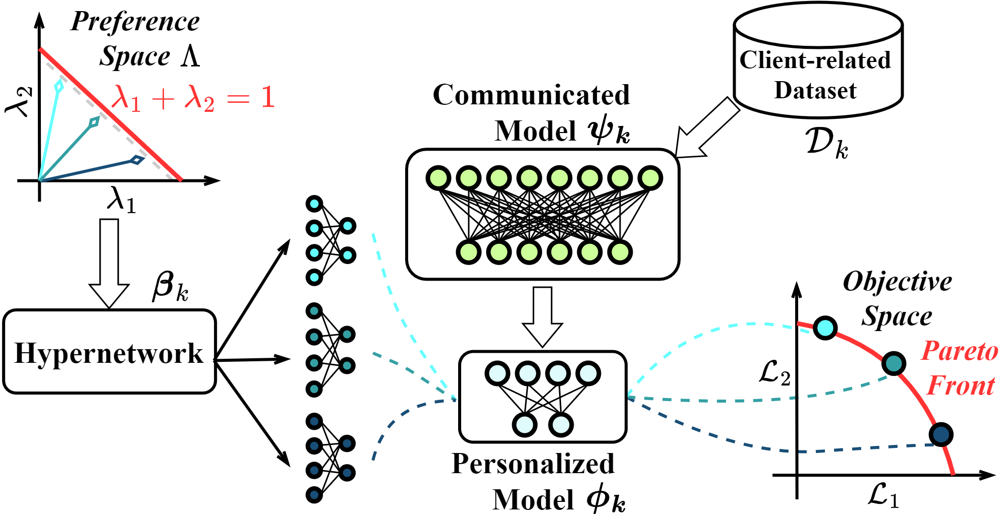

# PraFFL

This repository contains the implementation for the paper "PraFFL: A Preference-Aware Scheme in Fair Federated Learning" accepted by KDD 2025.

Here is the arXiv link https://arxiv.org/abs/2404.08973.



# Acknowledgement
Our implementation depends on https://github.com/yzeng58/Improving-Fairness-via-Federated-Learning/tree/main.

# Installation Dependencies
Our provide the packages file of our environment (requirement.txt), you can using the following command to download the environment:

```bash
# Switch Path
cd ./PraFFL
# Download dependency packages
pip install -r requirements.txt
```
# Training
## Parameters
- name: algorithm names (Available are uflfb, fflfb, agnosticfair, fairfed, fedfb, equifl, and praffl)
- model: The default is a multilayer perceptron.
- dataset： Available are synthetic, compas, bank, and adult.
- num_sim: the number of runs (the default is 3).
- num_rounds: the number of rounds in federated learning (the default is 10).
- pref_bs: the number of sampling preference vectors in every batch (we suggest 8 is enough).
- local_times: the number of local epochs of communicated model (the default is 15).
- n_obj: the number of objectives (the default is 2).
## Running Command
For instance, runung praffl on synthetic dataset:

`python DP_run.py --name praffl -dataset synthetic --num_sim 3 --num_rounds 10 --local_times 15`
# Citation
If you find our paper or code is useful, please consider citing:

```bibtex
@article{ye2024praffl,
  title={PraFFL: a preference-aware scheme in fair federated learning},
  author={Ye, Rongguang and Kou, Wei-Bin and Tang, Ming},
  journal={arXiv preprint arXiv:2404.08973},
  year={2024}
}
```
